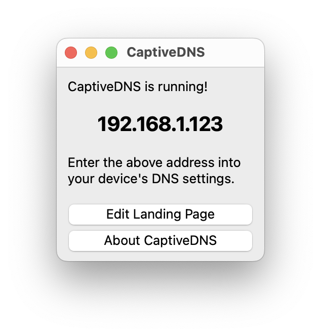

# CaptiveDNS
An app to help display a [captive portal](https://en.wikipedia.org/wiki/Captive_portal) browser to other devices on the network via DNS. Run this app on your computer, enter the DNS in the target device settings, and the captive portal should be displayed.

Based on [YourFriendlyDNS](https://github.com/softwareengineer1/YourFriendlyDNS/), which contains many more advanced options for other self-hosted DNS use cases.

## Screenshots


## Captured Domains

If a captive portal test domain is missing here, please file an issue and it will be added to the redirection list.

```
ctest.cdn.nintendo.net
conntest.nintendowifi.net
detectportal.firefox.com
connectivitycheck.gstatic.com
connectivitycheck.android.com
clients1.google.com
clients3.google.com
captive.apple.com
```

This list of domains cannot be configured within CaptiveDNS. To customize it further, check out [YourFriendlyDNS](https://github.com/softwareengineer1/YourFriendlyDNS/).

## Compiling

```
git clone git@github.com:BrowseDNS/CaptiveDNS.git
cd CaptiveDNS/CaptiveDNS
qmake
make
```

## License
This software is licensed under the GPLv2.

If you like this software, please support the YourFriendlyDNS author, [softwareengineer1](https://github.com/softwareengineer1), through one of the below methods!

```
BCH: bitcoincash:qzh3knl0xeyrzrxm5paenewsmkm8r4t76glzxmzpqs
BTC: 1279WngWQUTV56UcTvzVAnNdR3Z7qb6R8j
```